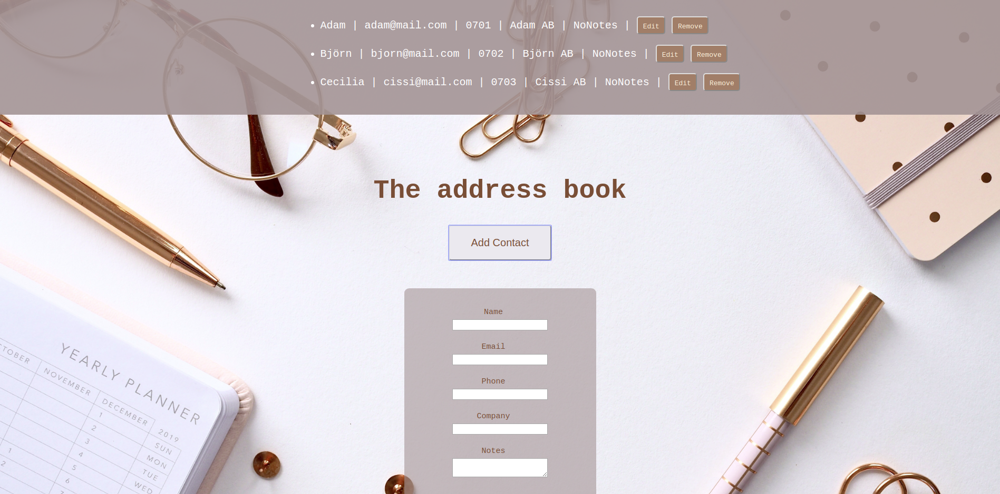

# The Address Book
**week 4 of learning how to code.** Building a basic address book that saves contacts in LocalStorage using Javascript. Testing functions with Cypress and launching with Netify. [Visit and try out the address book live.](https://rookieaddressbookbykarro.netlify.com/)

*More information below the image.*

### Assignment
**Make sure the user can:**
* Show and hide contact form using button with toggle function
* Add new contacts
* Remove contacts
* Saving contacts to LocalStorage

### Programs practiced in this challenge
* **Coding**
: | JavaScript | Html | Css |

* **Testing**
: | Cypress | Yarn |  

* **Launching**
: | GitHub | Netify |

* **Other**
: | VSCode | Hot Server |

## Build, test and launch
* Built with the source-code editor [Visual Studio Code](https://code.visualstudio.com/)
* Tested using [Cypress](https://www.cypress.io/); JavaScript End to End testing framework
* Launched using [Netify](https://www.netlify.com/); the All-in-one platform for automating modern web projects

## Authors
* **Karolina Frostare** has built this application
* **[Craft Academy](https://www.craftacademy.se/english/)** has created this challenge and provided the learning material needed to accept it

## Acknowledgments
* The image used was (royalty) free and provided by [Pixabay.com](https://pixabay.com/)
* This assignment was provided by [Craft Academy](https://www.craftacademy.se/english/)